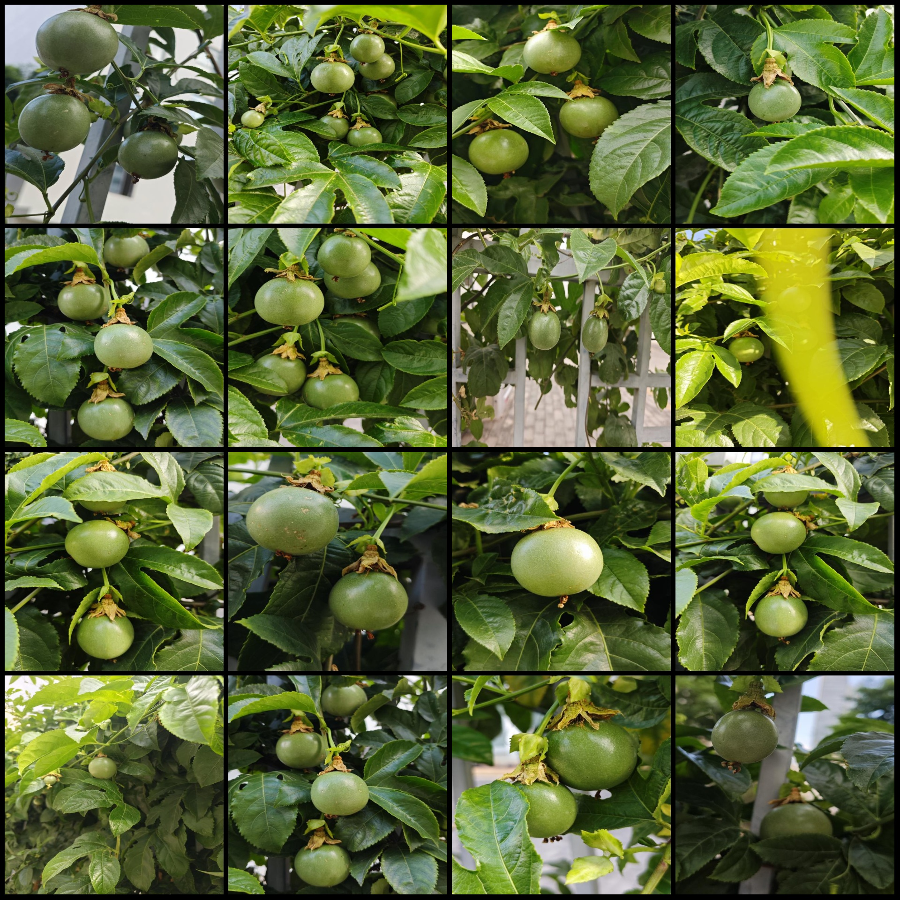
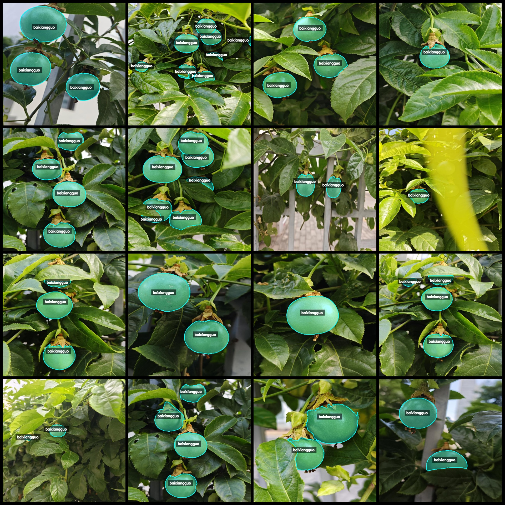
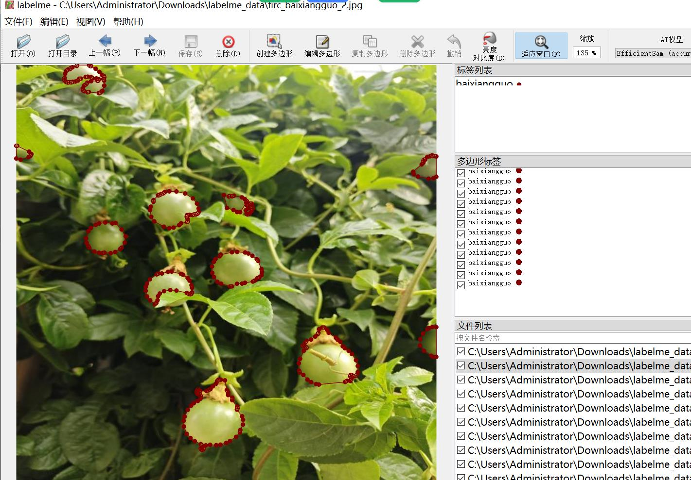

# Intelligent Orchard: Hundred-Purple Guava Identification and Segmentation Dataset in labelme Format

**Dataset Format:** labelme format (excluding mask files, only containing jpg images and corresponding json files)

**Image Count:** 1204

**Annotation Count:** 1204

**Annotation Category Count:** 1

**Annotation Category Name:** ["baixiangguo"]

**Each Category's Box Count:** 
"baixiangguo" count = 4533
Total boxes = 4533

**Labeling Tool Used:** labelme = 5.5.0

**Image Resolution:** 640x640

**Annotation Rules:** Polygon drawing for category classification

**Important Notes:** The dataset can be edited using labelme; the json dataset needs to be converted into either mask or YOLOF/COCO format for semantic segmentation or instance segmentation.

**Special Statement:** This dataset does not guarantee the accuracy of the trained models or weight files.

**Image Preview:** 

**Annotation Examples:**

**Randomly selected 16 images:**

**Annotation drawing results:**

**Labelme editing image example:**

## Images

Here is a pay link on Stripe ( https://buy.stripe.com/3cs8yP7sY87d0vu9AB ). Please contact me lonlonago@foxmail.com after funding $89, and I will send you a complete data files , thank you!

